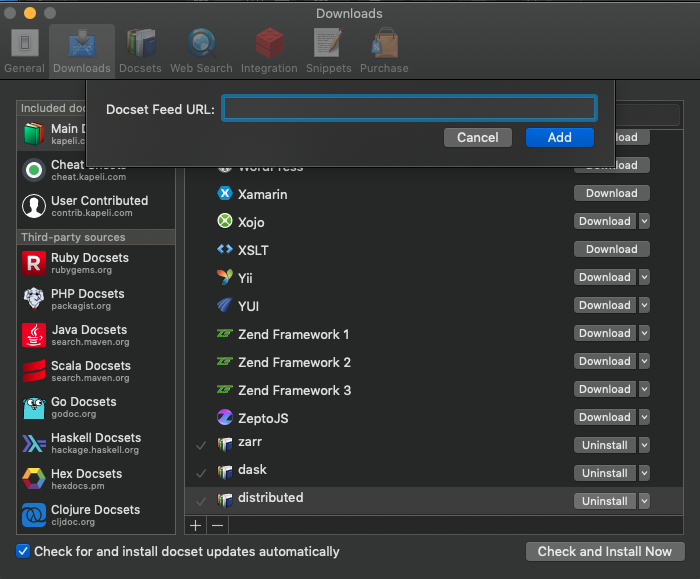

[](https://github.com/andersy005/dash-docsets/actions)

- [Dash Docsets](#dash-docsets)
  - [Docset Feeds](#docset-feeds)
  - [Zeal Issues](#zeal-issues)

# Dash Docsets

My Dash (https://kapeli.com/dash) docsets. Let the buyer beware ⚠️;)

**The main difference** between the docsets hosted in this repo and the official dash & dash user contributed docsets is that _these docsets are generated from the master branch of each project_.

Note: It's expected that these docsets should also work in [Zeal](https://zealdocs.org/) with some workarounds. **⚠️ See [Zeal Issues](#zeal-issues)** for more information on how to fix them.


## Docset Feeds

[Dash](https://kapeli.com/dash) and [Zeal](https://zealdocs.org/) can subscribe to the following feeds with a single click.

```bash
dash-feed://<URL encoded feed URL>
```

- [dask](https://github.com/dask/dask): https://raw.githubusercontent.com/andersy005/dash-docsets/docsets/feeds/dask.xml
- [distributed](https://github.com/dask/distributed): https://raw.githubusercontent.com/andersy005/dash-docsets/docsets/feeds/distributed.xml
- [dask-jobqueue](https://github.com/dask/dask-jobqueue): https://raw.githubusercontent.com/andersy005/dash-docsets/docsets/feeds/dask-jobqueue.xml
- [numba](https://github.com/numba/numba): https://raw.githubusercontent.com/andersy005/dash-docsets/docsets/feeds/numba.xml
- [zarr](https://github.com/zarr-developers/zarr-python): https://raw.githubusercontent.com/andersy005/dash-docsets/docsets/feeds/zarr.xml
- [numcodecs](https://github.com/zarr-developers/numcodecs): https://raw.githubusercontent.com/andersy005/dash-docsets/docsets/feeds/numcodecs.xml
- [xarray](https://github.com/pydata/xarray): https://raw.githubusercontent.com/andersy005/dash-docsets/docsets/feeds/xarray.xml
- [intake](https://github.com/intake/intake): https://raw.githubusercontent.com/andersy005/dash-docsets/docsets/feeds/intake.xml
- [fsspec](https://github.com/intake/filesystem_spec): https://raw.githubusercontent.com/andersy005/dash-docsets/docsets/feeds/fsspec.xml
- [climpred](https://github.com/bradyrx/climpred): https://raw.githubusercontent.com/andersy005/dash-docsets/docsets/feeds/climpred.xml
- [jupyterhub](https://github.com/jupyterhub/jupyterhub): https://raw.githubusercontent.com/andersy005/dash-docsets/docsets/feeds/jupyterhub.xml
- [binderhub](https://github.com/jupyterhub/binderhub): https://raw.githubusercontent.com/andersy005/dash-docsets/docsets/feeds/binderhub.xml
- [binder](https://github.com/jupyterhub/binder): https://raw.githubusercontent.com/andersy005/dash-docsets/docsets/feeds/binder.xml
- [xgcm](https://github.com/xgcm/xgcm): https://raw.githubusercontent.com/andersy005/dash-docsets/docsets/feeds/xgcm.xml
- [trio](https://github.com/python-trio/trio): https://raw.githubusercontent.com/andersy005/dash-docsets/docsets/feeds/trio.xml
- [proplot](https://github.com/lukelbd/proplot): https://raw.githubusercontent.com/andersy005/dash-docsets/docsets/feeds/proplot.xml



## Zeal Issues

When subscribing to docsets feeds, Zeal appears to be not working properly:


You may get the following error:


**Solution**:

- Download docsets from https://github.com/andersy005/dash-docsets/tree/docsets/docsets
- Find Zeal's docset storage directory by navigating to `Edit` -> `Preferences` from Zeal Menu bar.

- Untar the downloaded docset into zeal's docset storage directory

  ```bash
  tar -zxvf docset.tgz --directory zeal-docset-storage-directory
  ```

  Replace `docset.tgz` with the location of the downloaded docset, and `zeal-docset-storage-directory` with the found zeal's docset storage directory
