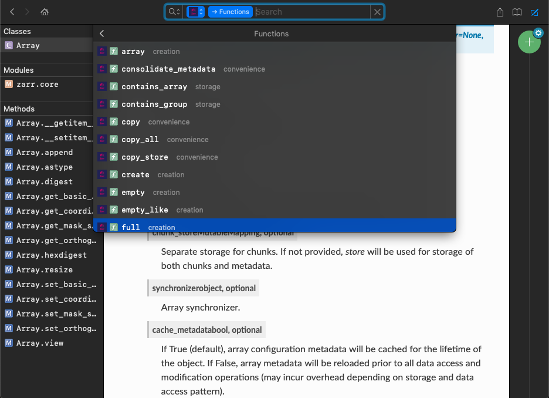
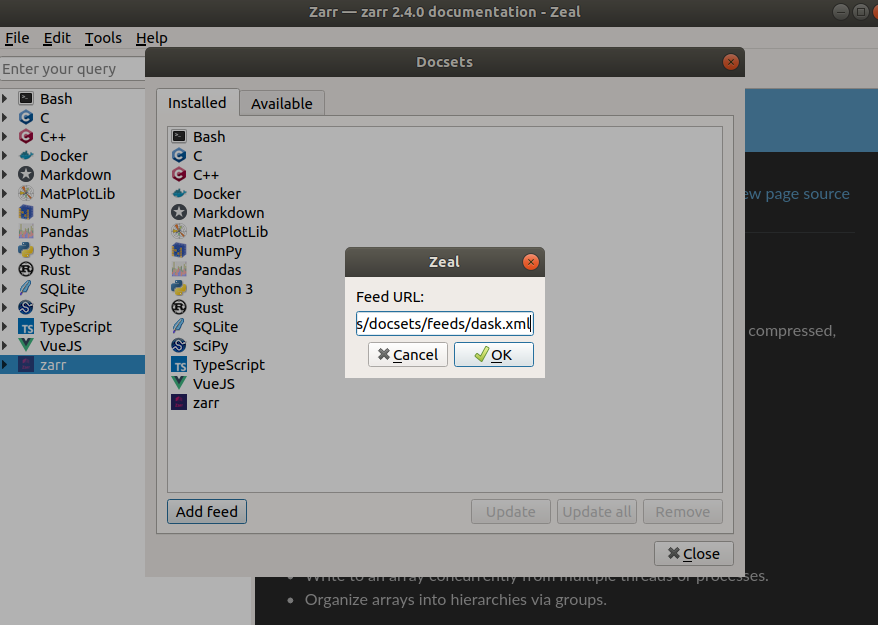
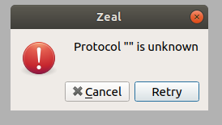

[](https://github.com/andersy005/dash-docsets/actions)

- [Dash Docsets](#dash-docsets)
  - [Docset Feeds](#docset-feeds)
  - [Zeal Issues](#zeal-issues)

# Dash Docsets

My Dash (https://kapeli.com/dash) docsets. Let the buyer beware ⚠️;)

**The main difference** between the docsets hosted in this repo and the official dash & dash user contributed docsets is that _these docsets are generated from the master branch of each project_.

Note: It's expected that these docsets should also work in [Zeal](https://zealdocs.org/) with some workarounds. **⚠️ See [Zeal Issues](#zeal-issues)** for more information on how to fix them.



## Docset Feeds

For instructions on how to subscribe to feeds, check this [page](https://github.com/andersy005/dash-docsets/blob/docsets/feeds/README.md).

## Zeal Issues

When subscribing to docsets feeds, Zeal appears to be not working properly:



You may get the following error:



**Solution**:

- Download docsets from https://github.com/andersy005/dash-docsets/tree/docsets/docsets
- Find Zeal's docset storage directory by navigating to `Edit` -> `Preferences` from Zeal Menu bar.

- Untar the downloaded docset into zeal's docset storage directory

  ```bash
  tar -Jcvf docset.tar.xz --directory zeal-docset-storage-directory
  ```

  Replace `docset.tar.xz` with the location of the downloaded docset, and `zeal-docset-storage-directory` with the found zeal's docset storage directory
