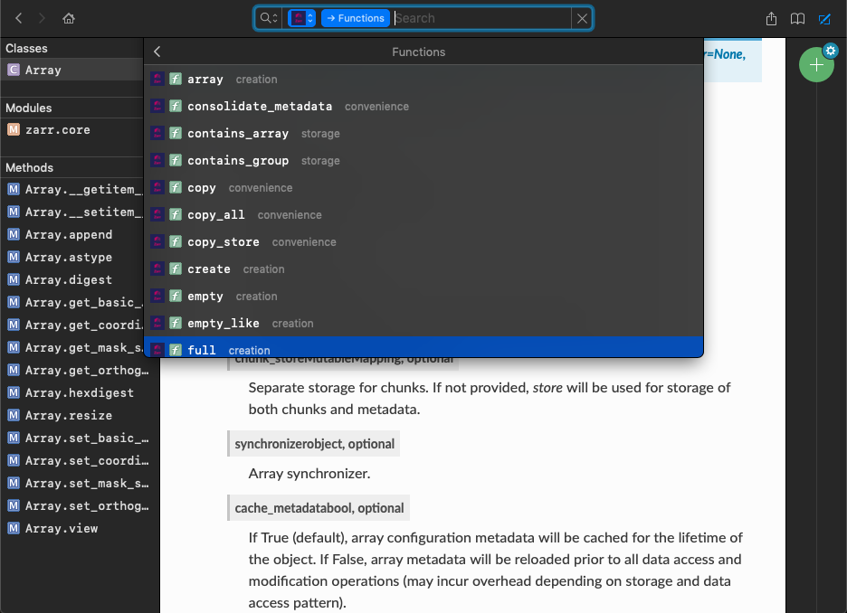
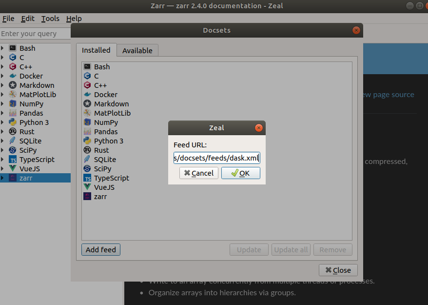
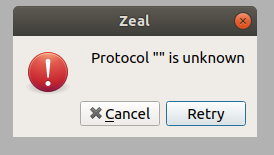

[](https://github.com/andersy005/dash-docsets/actions)

# Dash Docsets

This repo builds Dash docsets from upstream project docs and publishes them as release assets.

The short version is this:

- It tracks fast-moving projects.
- It rebuilds from current project docs.
- It favors practical automation over perfect consistency.

If docs break upstream, a config tweak is usually enough to get back on track.



## What Gets Produced

- `docsets/*.tar.gz` docset archives
- `feeds/*.xml` Dash feed entries (one per docset)
- optionally `feeds/README.md` when you run `update-feed-list`

## Build Model

`builder.py` drives the full process:

1. clone or reuse each source repo under a temp workspace
2. build docs using project-specific settings
3. convert HTML output to a Dash docset (`doc2dash` or `html2dash`)
4. archive docsets and write feed XML files

By default, each project is built in its own Pixi environment inside the cloned repo at:

`<cloned-repo>/.dash-docsets-pixi/pyproject.toml`

This keeps project dependencies isolated and avoids polluting the root tooling environment.
All local commands now go through `builder.py`.

## Prerequisites

- [Pixi](https://pixi.sh/latest/)
- Git
- `tar`
- `rsync` (used by `html2dash.py`)

## Quick Start

```bash
# install root tooling environment
pixi install

# build one config set
pixi run python builder.py build configs/arctic.yaml

# regenerate local feed index markdown from local docsets/
pixi run python builder.py update-feed-list
```

Build with an explicit release base URL:

```bash
pixi run python builder.py build configs/arctic.yaml \
  --docset-base-url "https://github.com/<owner>/<repo>/releases/download/docsets-latest"
```

## CI and Release Flow

GitHub Actions builds configured docsets, uploads artifacts, and refreshes a rolling release tag:

`docsets-latest`

Build outputs from CI:

- `*.tar.gz` docset archives
- `*.xml` feed files
- feed `README.md`

Useful env vars in CI or local runs:

- `DOCSET_BASE_URL` for archive links in feed entries
- `FEED_ROOT_URL` for feed README links

## Configuration

Build configs are YAML lists under `configs/` (for example `configs/arctic.yaml`).

Each project entry supports:

- `name` (required): docset name
- `repo` (required): GitHub `owner/repo`
- `generator`: `doc2dash` or `html2dash` (default: `doc2dash`)
- `doc_dir`: docs root inside the repo (default: `docs`)
- `doc_build_cmd`: command run in `doc_dir`
- `html_pages_dir`: built HTML path relative to `doc_dir` (default: `_build/html`)
- `install`: run `python -m pip install -e .` before build (default: `true`)
- `use_pixi_env`: build in per-project Pixi env (default: `true`)
- `pixi_python`: Python spec for project env (default: `3.13.*`)
- `pixi_channels`: Pixi channels for project env (default: `["conda-forge"]`)
- `pixi_platforms`: Pixi platforms for project env (default: `["linux-64", "osx-arm64"]`)
- `pixi_dependencies`: extra per-project dependencies map

Example:

```yaml
- name: xarray
  repo: pydata/xarray
  doc_dir: doc
  html_pages_dir: _build/html
  doc_build_cmd: sphinx-build -T -E -b html ./ _build/html
  use_pixi_env: true
  pixi_python: "3.13.*"
  pixi_dependencies:
    sphinx: ">=8"
    make: "*"
```

## Feeds

Published feed docs and feed XML files are attached to the rolling release tag:

`docsets-latest`

For subscription instructions, see:

https://github.com/andersy005/dash-docsets/releases/download/docsets-latest/README.md

## Zeal Notes

Zeal can fail when subscribing to these feeds directly in some setups.

If that happens:

1. Download the `.tar.gz` docset from the latest release assets.
2. In Zeal, open `Edit -> Preferences` and find your docset storage directory.
3. Extract the archive into that directory:

```bash
tar -xzvf docset.tar.gz --directory /path/to/zeal/docsets
```



